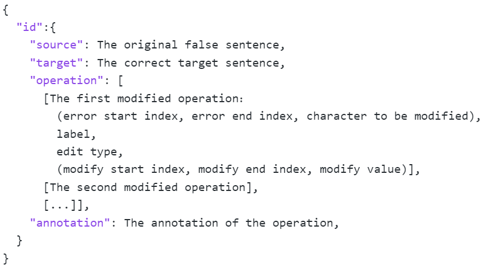

# FlaCGEC

## FlaCGEC: A Chinese Grammatical Error Correction Dataset with Fine-grained Linguistic Annotation 

论文的PDF版本可以在以下链接中进行查看：

[FlaCGEC: A Chinese Grammatical Error Correction Dataset with Fine-grained Linguistic Annotation]:(https://dl.acm.org/doi/10.1145/3583780.3615119)

 如果您认为我们的工作对您的工作有帮助，请引用我们的论文： 

```latex
@inproceedings{Hanyue_Du_CIKM23,
author = {Du, Hanyue and Zhao, Yike and Tian, Qingyuan and Wang, Jiani and Wang, Lei and Lan, Yunshi and Lu, Xuesong},
title = {FlaCGEC: A Chinese Grammatical Error Correction Dataset with Fine-Grained Linguistic Annotation},
year = {2023},
isbn = {9798400701245},
publisher = {Association for Computing Machinery},
address = {New York, NY, USA},
url = {https://doi.org/10.1145/3583780.3615119},
doi = {10.1145/3583780.3615119},
booktitle = {Proceedings of the 32nd ACM International Conference on Information and Knowledge Management},
pages = {5321–5325},
numpages = {5},
keywords = {Chinese grammatical error correction, deep learning, fine-grained linguistic annotation},
location = {Birmingham, United Kingdom},
series = {CIKM '23}
}
```


## Dataset Description

中文语法错误纠正 (CGEC) 旨在检测和纠正句子中的所有语法错误，已受到越来越多的研究人员的关注。尽管目前已经开发了多个 CGEC 数据集来支持研究，但这些数据集仍缺乏提供语法错误的深层语言拓扑的能力。为解决这个限制，本仓库提供了一个新的 CGEC 数据集：FlaCGEC，它具有细粒度的语言注释，包含 78 个实例化语法点和 3 种编辑类型， 数据的整体统计如下表所示。 

| Properties                     | Train | Dev   | Test  |
| ------------------------------ | ----- | ----- | ----- |
| Sentences                      | 10804 | 1334  | 1325  |
| Average source sentence length | 35.09 | 34.76 | 35.83 |
| Average target sentence length | 35.59 | 35.29 | 36.34 |
| Edits per sentence             | 1.72  | 1.69  | 1.71  |
| Grammar points                 | 77    | 69    | 72    |

数据集下载地址见本仓库data文件夹：https://github.com/hyDududu/FlaCGEC/tree/main/data

### Data Structure

FlaCGEC数据集以 JSON 文件形式进行存储，具体数据结构如下所示：



### Some Examples

下表中展示了 FlaCGEC 数据集的一些示例，一个句子可能存在多个错误，并且错误涉及句子的不同组成部分。

<table>
	<tr>
		<td>
            [S] 节日期间，<strong style="color:red;">每</strong>饭店纷纷推出特色餐饮<strong style="color:red;">特惠措施</strong>，吸引市民走进饭店.<br>
            Translation: During the festival, <strong style="color:red;">per</strong> hotel introduces special <strong style="color:red;">cuisines</strong> promotion activities, attracting citizens to walk in.<br>
            [T] 节日期间，各饭店纷纷推出特色餐饮和特惠措施，吸引市民走进饭店。<br/>Translation: During the festival, every hotel introduces special cuisines and promotion activities, attracting citizens to walk in.<br>
            [A] 5 5|||S-Demonstrative pronouns<sub>指示代词</sub>|||各；16 16|||M-Prepositions for objects<sub>介词引出对象</sub>|||和
        </td>
	</tr>
    <tr>
        <td>
            [S] 睡觉时，身体<strong style="color:red;">感觉到</strong>，人就容易梦到什么内容。<br />
            Translation: During sleeping, people easily <strong style="color:red;">dream</strong> the bodies feel.<br />
            [T] 睡觉时，身体感觉到什么，人就容易梦到什么内容。<br />
            Translation: During sleeping, people easily dream what the bodies feel.<br />
            [A] 9 9|||M-Non-interrogative use of interrogative pronouns<sub>疑问词的非疑问用法</sub>|||什么
        </td>
	</tr>
    <tr>
        <td>
            [S] 他<strong style="color:red;">听</strong>很不服气地说：“我尽力而为了<strong style="color:red;">已经</strong>！”<br />
            Translation: He <strong style="color:red;">listens</strong> and said disgruntledly: “I <strong style="color:red;">already</strong> have tried !”<br />
            [T] 他听了很不服气地说：“我已经尽力而为了！”<br />
            Translation: He listened and said disgruntledly: “I have already tried !”<br />
            [A] 2 2|||M-Aspect particle<sub>动态助词</sub>|||了；16 17|||W-Adverbs of time<sub>时间副词</sub>|||None
        </td>
    </tr>
    <tr>
        <td>
            [S] <strong style="color:red;">但有没</strong>受到老板的责备，<strong style="color:red;">而且</strong>他心里很失落。<br />
            Translation: <strong style="color:red;">But did he</strong> receive the blame from his boss, <strong style="color:red;">and</strong> he is upset.<br />
            [T] 虽然没有受到老板的责备，但是他心里很失落。<br />
            Translation: Even though he did not receive the blame from his boss, he is upset.<br />
            [A] 0 0\|\|\|S-Conjunctions for connecting clauses<sub>介词连接分句</sub>|||虽然；2 2|||W-Negative adverb<sub>否定副词</sub>|||没；11 12|||W-Conjunctions for connecting clauses<sub>介词连接分句</sub>|||但是
        </td>
    </tr>
</table>

###  Some Grammar Points

下表列出了部分实例化语法点、和它们相应的示例。

<table>
	<tr>
		<td>Grammar Points</td>
		<td>Instantiations</td>
		<td>Examples</td>
	</tr>
	<tr>
		<td rowspan="2">Adverbs of degree<sub>[程度副词]</sub></td>
		<td>很</td>
		<td>有的人<font color="blue">很</font>从容。</td>
	</tr>
	<tr>
		<td>有点儿</td>
		<td>左边这瓶<font color="blue">有点儿</font>酸。</td>
	</tr>
	<tr>
		<td rowspan="3">Conjunctions for connecting clauses<sub>[介词连接分句]</sub></td>
		<td>如果</td>
		<td><font color="blue">如果</font>没有标记，散落的片断将…</td>
	</tr>
	<tr>
		<td>因此</td>
		<td><font color="blue">因此</font>，人们以乌龟指长寿。</td>
	</tr>
	<tr>
		<td>总之</td>
		<td><font color="blue">总之</font>，电视带给我们知识和娱乐。</td>
	</tr>
	<tr>
		<td rowspan="2">Modal verbs<sub>[能愿动词]</sub></td>
		<td>需要</td>
		<td>这项工程至少<font color="blue">需要</font>10年时间才能完工。</td>
	</tr>
	<tr>
		<td>得</td>
		<td>妈妈生病了，我<font color="blue">得</font>马上回国去看她。</td>
	</tr>
	<tr>
		<td rowspan="2">Passive sentences<sub>[被动句]</sub></td>
		<td>被</td>
		<td>自行车<font color="blue">被</font>当做一种交通工具。</td>
	</tr>
	<tr>
		<td>被…所</td>
		<td>快乐的人不会<font color="blue">被</font>痛苦<font color="blue">所</font>左右。</td>
	</tr>
	<tr>
		<td rowspan="2">Successive complex sentences<sub>[承接复句]</sub></td>
		<td>于是</td>
		<td>唐太宗很生气，<font color="blue">于是</font>召集群臣，当面训斥魏征。</td>
	</tr>
	<tr>
		<td>便</td>
		<td>司马光受父亲影响，自幼<font color="blue">便</font>聪明好学。</td>
	</tr>
</table>


