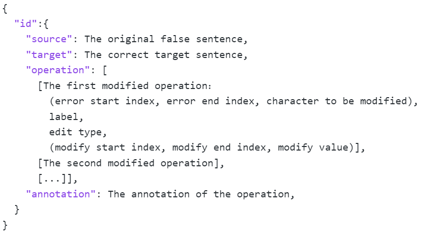

# FlaCGEC

### Data Structure

We leverage JSON format to organize our data, as illustrated below:

 Figure 1: A screenshot of the JSON file.

### More Examples

We show more examples in FlaCGEC dataset in Table 1.
As we can see, multiple errors exist in a sentence and they may refer to different constituents of the sentences.

| [S] 节日期间，<strong style="color:red;">每</strong>饭店纷纷推出特色餐饮<strong style="color:red;">特惠措施</strong>，吸引市民走进饭店. Translation: During the festival, <strong style="color:red;">per</strong> hotel introduces special <strong style="color:red;">cuisines</strong> promotion activities, attracting citizens to walk in. [T] 节日期间，各饭店纷纷推出特色餐饮和特惠措施，吸引市民走进饭店。 Translation: During the festival, every hotel introduces special cuisines and promotion activities, attracting citizens to walk in. [A] 5 5\|\|\|S-Demonstrative pronouns~[指示代词]~\|\|\|各；16 16\|\|\|M-Prepositions for objects~[介词引出对象]~\|\|\|和 |
| ------------------------------------------------------------ |
| **[S] 睡觉时，身体<strong style="color:red;">感觉到</strong>，人就容易梦到什么内容。 Translation: During sleeping, people easily <strong style="color:red;">dream</strong> the bodies feel. [T] 睡觉时，身体感觉到什么，人就容易梦到什么内容。 Translation: During sleeping, people easily dream what the bodies feel. [A] 9 9\|\|\|M-Non-interrogative use of interrogative pronouns~[疑问词的非疑问用法]~\|\|\|什么** |
| **[S] 他<strong style="color:red;">听</strong>很不服气地说：“我尽力而为了<strong style="color:red;">已经</strong>！” Translation: He <strong style="color:red;">listens</strong> and said disgruntledly: “I <strong style="color:red;">already</strong> have tried !” [T] 他听了很不服气地说：“我已经尽力而为了！” Translation: He listened and said disgruntledly: “I have already tried !” [A] 2 2\|\|\|M-Aspect particle~[动态助词]~\|\|\|了；16 17\|\|\|W-Adverbs of time~[时间副词]~\|\|\|None** |
| **[S] <strong style="color:red;">但有没</strong>受到老板的责备，<strong style="color:red;">而且</strong>他心里很失落。 Translation: <strong style="color:red;">But did he</strong> receive the blame from his boss, <strong style="color:red;">and</strong> he is upset. [T] 虽然没有受到老板的责备，但是他心里很失落。 Translation: Even though he did not receive the blame from his boss, he is upset. [A] 0 0\|\|\|S-Conjunctions for connecting clauses~[介词连接分句]~\|\|\|虽然；2 2\|\|\|W-Negative adverb~[否定副词]~\|\|\|没；11 12\|\|\|W-Conjunctions for connecting clauses~[介词连接分句]~\|\|\|但是** |

 Table 1: More examples of fine-grained linguistic annotation. 

###  More Grammar Points

We list more instantiated grammar points that we discussed in this paper, their difficulty levels and their examples in Table 2.

<table>
	<tr>
		<td>Grammar Points</td>
		<td>Instantiations</td>
		<td>Examples</td>
	</tr>
	<tr>
		<td rowspan="2">Adverbs of degree[程度副词]</td>
		<td>很</td>
		<td>有的人很从容</td>
	</tr>
	<tr>
		<td>有点儿</td>
		<td>左边这瓶有点儿酸</td>
	</tr>
	<tr>
		<td rowspan="3">Conjunctions for connecting clauses[介词连接分句]</td>
		<td>如果</td>
		<td>如果没有标记，散落的片断将…</td>
	</tr>
	<tr>
		<td>因此</td>
		<td>因此，人们以乌龟指长寿。</td>
	</tr>
	<tr>
		<td>总之</td>
		<td>总之，电视带给我们知识和娱乐。</td>
	</tr>
	<tr>
		<td rowspan="2">Modal verbs[能愿动词]</td>
		<td>需要</td>
		<td>这项工程至少需要10年时间才能完工。</td>
	</tr>
	<tr>
		<td>得</td>
		<td>妈妈生病了，我得马上回国去看她。</td>
	</tr>
</table>

Table 2: Selected instantiated grammar points of FlaCGEC dataset. The words or phrases related to the grammar points are highlighted with <strong style="color:blue;">blue </strong>color.

### Grammar Point Annotation Process

To annotate related grammar points of a sentence, we display the overall annotation pipeline in Figure 2.

Figure 2: The grammar point annotation process.

We first write rules to annotate grammar in HSK corpus via regex.
Meanwhile, we leverage the illustrative examples in the textbook as training data where the grammar points and corresponding sentences are given.
We merge the sentences from HSK corpus and illustrative examples from textbook, treating them as training samples.
Then we employ the PLMs of Chinese-BERT model as a tagging model to tag the grammar points that are related to the sentence and train with the training samples.
After training, we apply the well-trained model to the unlabeled HSK corpus and select the predicted sentences with high confidence scores as the labeled training samples.
We merge them with the existing training samples and train a new tagging model.
This procedure repeats for multiple iterations until the number of training samples does not increase greatly.

Eventually, we obtain a set of sentences annotated with related grammar points as the target sentences.

### Annotation Process

We chunk the entire data into multiple batches and automatically create an excel worksheet for each batch. 
Before annotation, we ask each annotator to read the guidelines carefully (See Figure 3), which describe judgment criterion, annotation operations, and typical examples. 
Each annotator needs to follow the guidelines to complete the scoring.

We also show the translated interface for filtering the base cases in Figure 4. As depicted in the figure, the blue part that the annotators need to fill.
Column 2 and 3 are source sentences and target sentences generated via rules. 
Column 4 is the area where the annotator fills in the score to the source sentence according to the criterion in guideline.
Column 5 is the area where the annotator fills in the score to judge the grammar points and whether edit operations in column 5 are correct or not.

Figure 3: Annotation guidelines that describe judgment criterion, annotation operations, and typical examples.

Figure 4: Interface of bad cases filtering.

### More Statistics of FlaCGEC

                                  

Figure 5: Distribution of sentence topics in FlaCGEC.                 

Figure 6: Length distribution of sentences.

We display more statistics of our dataset below. We collect the frequent tokens in the dataset as the topics and display the distribution of sentence topics in FlaCGEC in Figure 5. As we can see, FlaCGEC contains sentences covering a wide range of topics.
Amongst them, the most frequent topics are life, time, health, and etc. This indicates that the collected data is practical and covers wide scenarios of language expression. We display the length distribution of sentences over different levels in Figure 6. We can see most sentences have a length ranging from $20$ to $40$.
There are also some short sentences with length smaller than $20$ and long sentences with length longer than $80$.

### Implementation Details

For GECToR-Chinese, we employ the StructBert as its encoder and train the model with the Adam optimizer. 
We set batch size as $16$ and learning rate as $1e-5$ for training.
The maximum training epoch number is set as $40$ for all evaluated datasets. 
In addition, we setup a warm-up procedure, where the model is first trained for $2$ cold epochs with a learning rate of $1e-3$.

For Chinese BART, we leverage Chinese-BART-Large as the pre-trained model, and train the model with the Adam optimizer.
We set the learning rate as $3e-6$, and adjust it with the learning rate scheduler of Polynomial.
The maximum training epoch number is set as $10$ for all evaluated datasets. 

For EBGEC, Transformer-big is employed as the encoder and the beam search with a beam size of $5$ is utilized as decoding strategy. We also train the model with the Adam optimizer. We set the learning rate as $5e-4$ for FlaCGEC and $5e-5$ for the other two datasets.