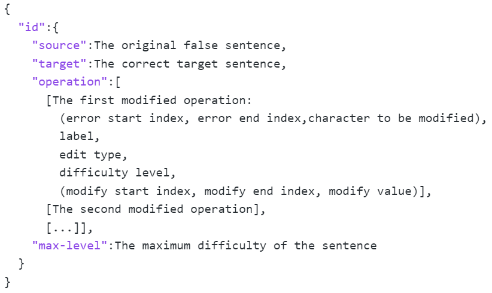
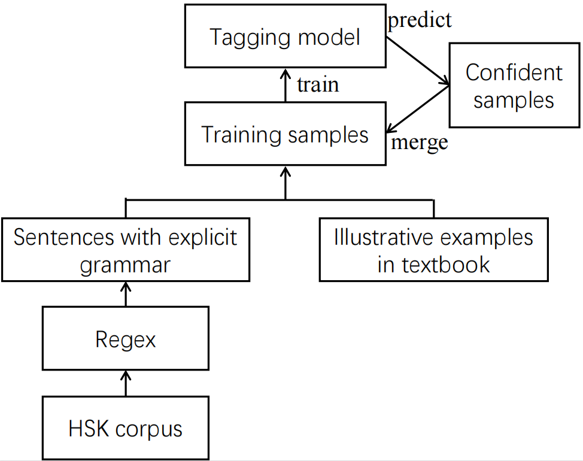
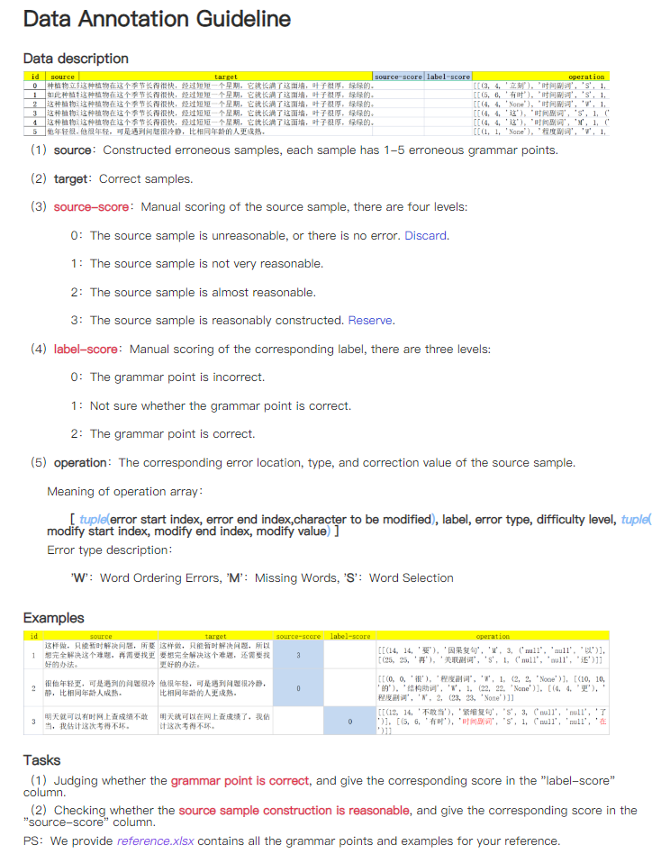
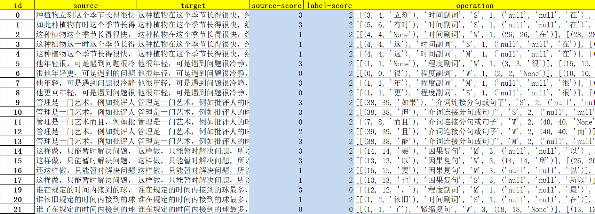
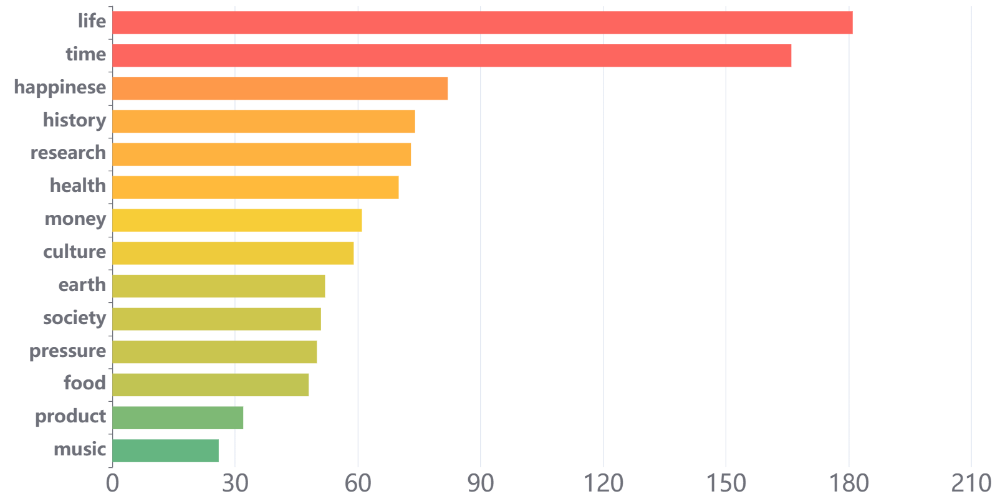
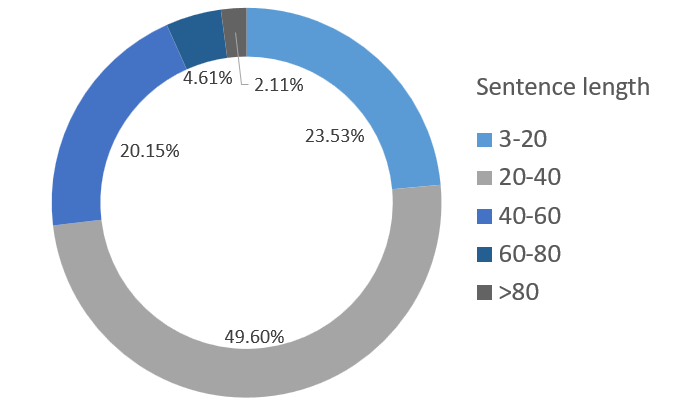

# FlaCGEC

### Data Structure

We leverage JSON format to organize our data, as illustrated below:

 Figure 1: A screenshot of the JSON file.

### More Examples

We show more examples in FlaCGEC dataset in Table 1.
As we can see, multiple errors exist in a sentence and they may refer to different constituents of the sentences.

###  More Grammar Points

We list more instantiated grammar points that we discussed in this paper, their difficulty levels and their examples in Table 2.

### Grammar Point Annotation Process

To annotate related grammar points of a sentence, we display the overall annotation pipeline in Figure 2.

Figure 2: The grammar point annotation process.

We first write rules to annotate grammar in HSK corpus via regex.
Meanwhile, we leverage the illustrative examples in the textbook as training data where the grammar points and corresponding sentences are given.
We merge the sentences from HSK corpus and illustrative examples from textbook, treating them as training samples.
Then we employ the PLMs of Chinese-BERT model as a tagging model to tag the grammar points that are related to the sentence and train with the training samples.
After training, we apply the well-trained model to the unlabeled HSK corpus and select the predicted sentences with high confidence scores as the labeled training samples.
We merge them with the existing training samples and train a new tagging model.
This procedure repeats for multiple iterations until the number of training samples does not increase greatly.

Eventually, we obtain a set of sentences annotated with related grammar points as the target sentences.

### Annotation Process

We chunk the entire data into multiple batches and automatically create an excel worksheet for each batch. 
Before annotation, we ask each annotator to read the guidelines carefully (See Figure 3), which describe judgment criterion, annotation operations, and typical examples. 
Each annotator needs to follow the guidelines to complete the scoring.

We also show the translated interface for filtering the base cases in Figure 4. As depicted in the figure, the blue part that the annotators need to fill.
Column 2 and 3 are source sentences and target sentences generated via rules. 
Column 4 is the area where the annotator fills in the score to the source sentence according to the criterion in guideline.
Column 5 is the area where the annotator fills in the score to judge the grammar points and whether edit operations in column 5 are correct or not.

Figure 3: Annotation guidelines that describe judgment criterion, annotation operations, and typical examples.

Figure 4: Interface of bad cases filtering.

### More Statistics of FlaCGEC

                                  

Figure 5: Distribution of sentence topics in FlaCGEC.                 

Figure 6: Length distribution of sentences.

We display more statistics of our dataset below. We collect the frequent tokens in the dataset as the topics and display the distribution of sentence topics in FlaCGEC in Figure 5. As we can see, FlaCGEC contains sentences covering a wide range of topics.
Amongst them, the most frequent topics are life, time, health, and etc. This indicates that the collected data is practical and covers wide scenarios of language expression. We display the length distribution of sentences over different levels in Figure 6. We can see most sentences have a length ranging from $20$ to $40$.
There are also some short sentences with length smaller than $20$ and long sentences with length longer than $80$.

### Implementation Details

For GECToR-Chinese, we employ the StructBert as its encoder and train the model with the Adam optimizer. 
We set batch size as $16$ and learning rate as $1e-5$ for training.
The maximum training epoch number is set as $40$ for all evaluated datasets. 
In addition, we setup a warm-up procedure, where the model is first trained for $2$ cold epochs with a learning rate of $1e-3$.

For Chinese BART, we leverage Chinese-BART-Large as the pre-trained model, and train the model with the Adam optimizer.
We set the learning rate as $3e-6$, and adjust it with the learning rate scheduler of Polynomial.
The maximum training epoch number is set as $10$ for all evaluated datasets. 

For EBGEC, Transformer-big is employed as the encoder and the beam search with a beam size of $5$ is utilized as decoding strategy. We also train the model with the Adam optimizer. We set the learning rate as $5e-4$ for FlaCGEC and $5e-5$ for the other two datasets.